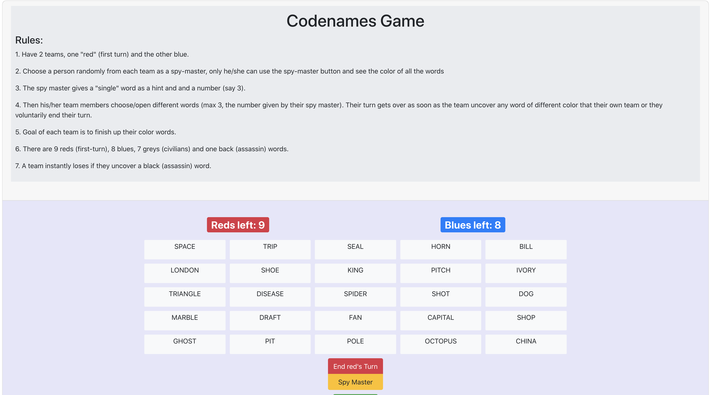

# codenames-spa

This is a single page web app to play codenames game online.

### Screenshots
Since, example speaks a thousand words!

  
  

[**Play it Now!**](https://lprakashv.github.io/codenames-spa/)

### Features:
* 400 built-in words.
* Random words assignement to 'red' and 'blue' color team on new game.
* Game reset (New game).
* Manual turn change or voluntary turn handover.
* Auto turn change on failing words (uncovering blue while red's turn or uncovering red while blue's turn).
* Auto game over and winner announcement after either a color exhaustion or uncovering "assassin" word tile.
* "spy-master" mode for spy masters to see all the words' colors and decide a hint.

### Main Technologies (in no specific order):
* **react** - for page rendering.
* **redux** - for state management.
* **react-social-icons** - for displaying social profofile icons with links to my profiles.
* **gh-pages** - for publishing bundled app to github pages.
* **bootstrap** - for standard styling.
